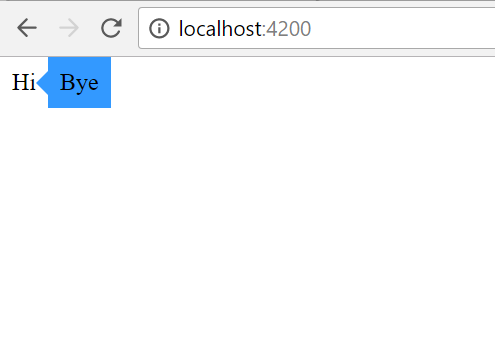

# ngx-better-tooltip

## Installation

To install this library, run:

```bash
$ npm install ngx-better-tooltip --save
```

## Usage

There are three directuves you must use `toottip-wrapper`, `toottip-target`, and `toottip-content`.  See below

From your Angular `AppModule`:

```typescript
import { BrowserModule } from '@angular/platform-browser';
import { NgModule } from '@angular/core';

import { AppComponent } from './app.component';

// Import your library
import { SampleModule } from 'ngx-better-tooltip';

@NgModule({
  declarations: [
    AppComponent
  ],
  imports: [
    BrowserModule,

    TooltipModule
  ],
  providers: [],
  bootstrap: [AppComponent]
})
export class AppModule { }
```


```xml
<tooltip-wrapper direction="right">
  <tooltip-content>
    Bye
  </tooltip-content>
  <tooltip-target>
    Hi
  </tooltip-target>
</tooltip-wrapper>
```



All available options are:
 - color: background color
 - display: css diplay mode of the host, defaults to `inline-block`
 - direction: defaults to `top`

## License

MIT © [Daniel Whitney](mailto:tiedye1@hotmail.com)
